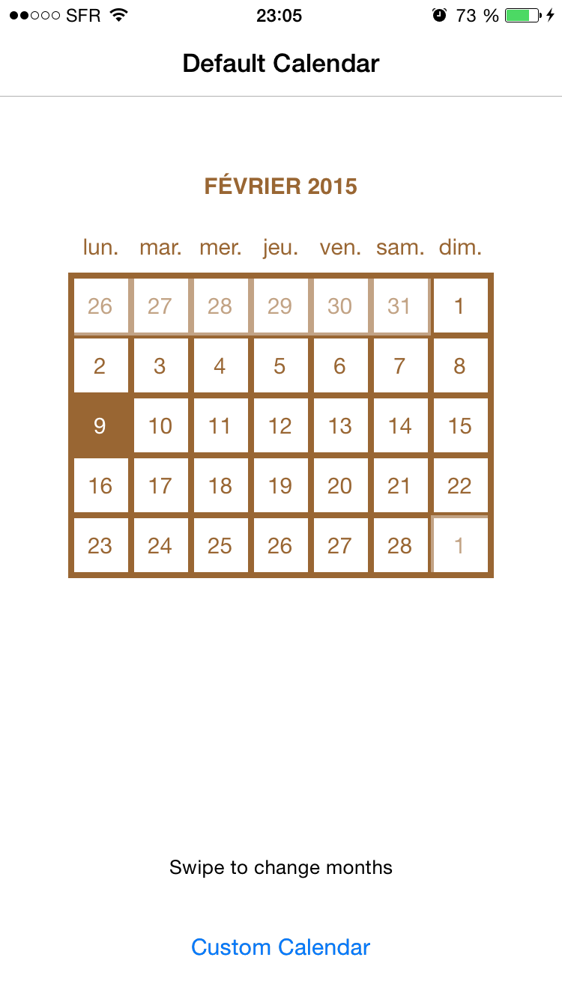
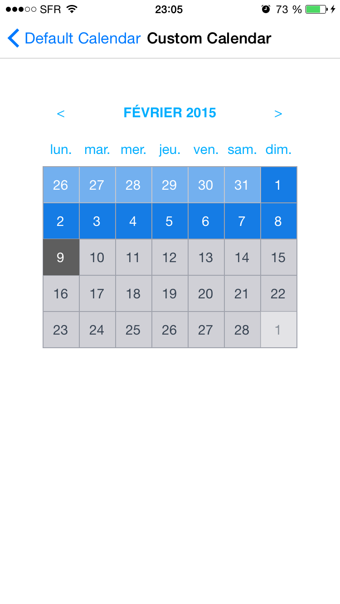

CustomCalendar
==============

 

Custom Calendar for iOS
Grid Calendar view for iOS created by Jubin Jacob  (jubinjacob19@gmail.com)
Swipe to change months.

Delegate displays selected date(NSDate) on selection of a date. 

Datasource allows some days to be highlighted and the calendar to be « locked » between a starting month and an ending month.
